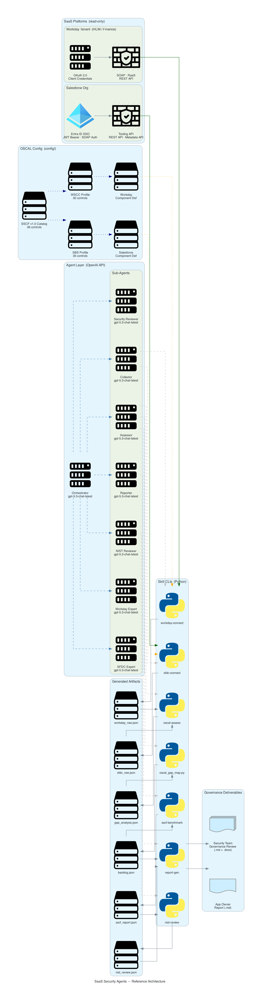

## Reference Architecture

> Auto-regenerated on every push to main. If this PR changes the architecture, the diagram updates automatically after merge.

---

## Summary
- What changed:
- Why:

## Risk Level
- [ ] low
- [ ] medium
- [ ] high

## Security Impact
- Threats considered:
- New permissions/identities introduced:
- Secret handling changes:

## Release Validation (RV)
- Commands run:
- Expected output:
- Actual result:

## Rollback / Backout
- Revert method:
- Terraform/image rollback steps:
- Data recovery impact:

## Changelog
- [ ] Updated `CHANGELOG.md` under `[Unreleased]`

