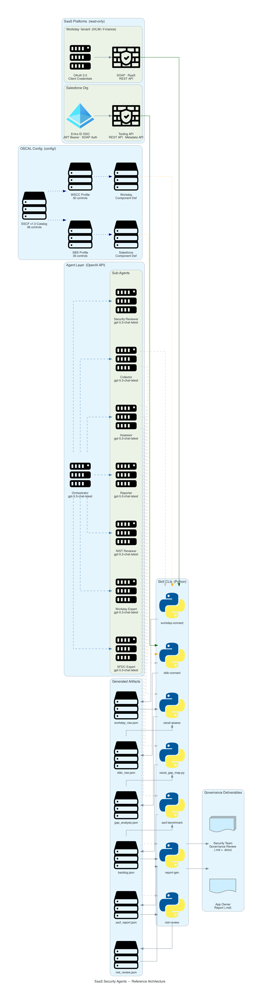
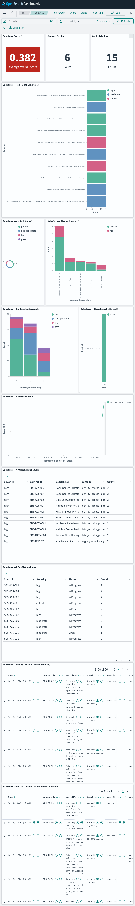
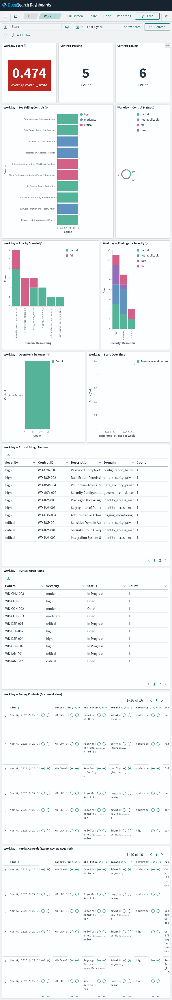

# saas-posture

[](LICENSE)
[](https://github.com/dfirs1car1o/saas-posture/actions/workflows/ci.yml)
[](https://www.python.org/)

SaaS Security multi-agent AI system for OSCAL and CSA SSCF assessments across Salesforce and Workday. Produces governance-grade evidence packages for application owners and business security review cycles.

> **New here?** Start with the **[Wiki →](https://github.com/dfirs1car1o/saas-posture/wiki)** for full onboarding instructions, platform-specific setup guides (macOS, Linux, Windows), pipeline walkthroughs, and a complete skill and agent reference.



## What This Is

A seven-phase, read-only security assessment pipeline powered by multi-agent AI with enforced tool sequencing and OWASP Agentic App Top 10 hardening. Each phase produces a structured artifact that feeds the next.

```
Phase 1 — Collect      sfdc-connect / workday-connect    →  sfdc_raw.json / workday_raw.json
Phase 2 — Assess       oscal-assess + oscal_gap_map       →  gap_analysis.json + backlog.json
Phase 3 — Score        sscf-benchmark                     →  sscf_report.json (RED/AMBER/GREEN)
Phase 4 — Gate         nist-reviewer (NIST AI RMF 1.0)    →  nist_review.json (clear/flag/block)
Phase 5 — OSCAL        gen_poam + gen_assessment_results  →  poam.json + assessment_results.json
           + gen_ssp + gen_aicm_crosswalk                 →  ssp.json + aicm_coverage.json
Phase 6 — Report       report-gen (app-owner + security)  →  Markdown + DOCX governance packages
Phase 7 — Monitor      export_to_opensearch + dashboards  →  OpenSearch trending + 3 dashboards
```

**Platform support:** Salesforce (35 SBS controls) · Workday (30 WSCC controls)
**Framework chain:** Platform control → SSCF v1.0 → CCM v4.1 → ISO 27001:2022 Annex A → SOX / HIPAA / SOC2 / NIST 800-53 / PCI DSS / GDPR
**AI governance chain:** SSCF v1.0 → CSA AICM v1.0.3 (243 controls, 18 domains) → EU AI Act / ISO 42001 / NIST AI 600-1 / BSI AI C4
**OSCAL output:** Resolved catalog · Assessment Results · System Security Plan · POA&M — all OSCAL 1.1.2 valid
**AI governance:** Every output passes through a NIST AI RMF gate before delivery — distinguishes live collection from stubs, requires human acknowledgment on block verdicts

This system **never writes to any SaaS org**. All evidence stays in `docs/oscal-salesforce-poc/generated/`.

## Quick Start

No Docker required. Runs fully from the command line with Python 3.11+.

```bash
git clone git@github.com:dfirs1car1o/saas-posture.git
cd saas-posture
python3 -m venv .venv && source .venv/bin/activate
pip install -e .
cp .env.example .env   # fill in credentials
python3 scripts/validate_env.py
```

**Run the full pipeline — Salesforce (live org):**
```bash
agent-loop run --env dev --org <org-alias> --approve-critical
```

**Run the full pipeline — Workday (live tenant):**
```bash
agent-loop run --platform workday --env dev --org <tenant-alias> --approve-critical
```

**Workday dry-run (no credentials needed):**
```bash
python3 scripts/workday_dry_run_demo.py --org acme-workday --env dev
```

**Generate a report without an API key (mock/test mode):**
```bash
python3 -m skills.report_gen.report_gen generate \
  --backlog docs/oscal-salesforce-poc/generated/<org>/<date>/backlog.json \
  --audience security \
  --out $(pwd)/docs/oscal-salesforce-poc/generated/<org>/<date>/report_security.md \
  --mock-llm
```

## Multi-Agent Architecture

```
Human ──► agent-loop run (harness/loop.py)
               │
               └──► Orchestrator (gpt-5.3-chat-latest)
                         │
                         ├── 1a. sfdc_connect_collect      → sfdc_raw.json        (Salesforce)
                         ├── 1b. workday_connect_collect   → workday_raw.json     (Workday)
                         ├── 1.5 backlog_diff              → drift_report.json    (re-assessments only)
                         ├── 2.  oscal_assess_assess       → gap_analysis.json
                         ├── 3.  oscal_gap_map             → backlog.json + matrix.md
                         ├── 4.  sscf_benchmark_benchmark  → sscf_report.json
                         ├── 5.  nist_review_assess        → nist_review.json     (AI RMF gate)
                         ├── 5d. gen_aicm_crosswalk        → aicm_coverage.json   (AICM v1.0.3)
                         ├── 5e. gen_poam                  → poam.json            (OSCAL POA&M)
                         ├── 5f. gen_assessment_results    → assessment_results.json
                         ├── 5g. gen_ssp                   → ssp.json             (System Security Plan)
                         ├── 6a. report_gen_generate       → *_remediation_report.md   (app-owner)
                         └── 6b. report_gen_generate       → *_security_assessment.md + .docx
```

All agents are OpenAI models. The orchestrator dispatches numbered tool calls to skills (Python CLIs). Agents communicate through JSON evidence files on disk — no shared state or MCP. **Tool sequencing is enforced in code** via `_TOOL_REQUIRES` in `harness/loop.py` — every call is validated against prerequisites before dispatch.

| Agent | Model | Role |
|---|---|---|
| Orchestrator | `gpt-5.3-chat-latest` | Plans and dispatches all pipeline steps |
| Collector | `gpt-5.3-chat-latest` | Interprets platform raw evidence data |
| Assessor | `gpt-5.3-chat-latest` | Runs OSCAL gap analysis and benchmarks |
| NIST Reviewer | `gpt-5.3-chat-latest` | Validates outputs; issues block/flag/pass verdicts |
| Reporter | `gpt-5.3-chat-latest` | Writes LLM narrative for governance reports |
| Security Reviewer | `gpt-5.3-chat-latest` | DevSecOps audit on CI/CD skill changes |
| SFDC Expert | `gpt-5.3-chat-latest` | On-call specialist for complex Salesforce/Apex/API questions |
| Workday Expert | `gpt-5.3-chat-latest` | On-call specialist for Workday HCM/Finance RaaS/REST |
| Container Expert | `gpt-5.3-chat-latest` | Docker Compose, OpenSearch, NDJSON dashboards, JVM tuning |

## Skills (CLIs)

All tools are CLI-based Python scripts. Each supports `--help` and `--dry-run`.

| Skill | Module | What It Does |
|---|---|---|
| `sfdc-connect` | `skills/sfdc_connect/` | Authenticates + queries Salesforce via REST and Tooling API |
| `oscal-assess` | `skills/oscal_assess/` | Gaps findings against the SBS OSCAL control catalog |
| `sscf-benchmark` | `skills/sscf_benchmark/` | Scores findings by CSA SSCF domain (red/amber/green) |
| `nist-review` | `skills/nist_review/` | NIST AI RMF 1.0 governance gate (govern/map/measure/manage) |
| `report-gen` | `skills/report_gen/` | Generates executive Markdown + DOCX reports with AICM annex |
| `workday-connect` | `skills/workday_connect/` | Workday HCM/Finance collector — OAuth 2.0, 30 controls, RaaS/REST/manual |
| `gen-aicm-crosswalk` | `scripts/gen_aicm_crosswalk.py` | CSA AICM v1.0.3 coverage crosswalk — 243 controls, 18 domains; registered agent tool |

### Report Structure

The security audience generates **three companion documents** — each audience gets only what they need:

**Main assessment** (`report_security.md` / `.docx`):
```
[Gate banner]                  ← ⛔ block / 🚩 flag if NIST verdict requires it
Companion document reference   ← links to annex + methodology files
Executive Scorecard            ← overall score + severity × status matrix
Domain Posture (ASCII chart)   ← bar chart of all SSCF domain scores
All Assessed Controls          ← every control, sorted critical→low, with action + due date
Executive Summary + Analysis   ← LLM narrative (risk + remediation)
Not Assessed Controls          ← out-of-scope appendix for auditors
NIST AI RMF Governance Review  ← govern/map/measure/manage function table + blockers
```

**Annex** (`report_security_annex.md` / `.docx`) — for governance/audit teams:
```
Full Control Matrix            ← complete sorted findings table
Plan of Action & Milestones    ← POAM-IDs, owners, due dates, Open/In Progress
OSCAL Framework Provenance     ← catalog → profile → component → ISO 27001 → CCM chain
CCM v4.1 Regulatory Crosswalk  ← fail/partial findings → SOX/HIPAA/SOC2/PCI/GDPR
ISO 27001:2022 SoA             ← full Statement of Applicability (all 93 Annex A controls)
```

**Evidence Methodology** (`report_security_methodology.md`) — for auditors verifying collection:
```
Per-control API queries        ← exact SOQL/REST endpoint used to assess each control
Collection method              ← API type (REST / Tooling / Metadata / RaaS / manual)
```

## Control Frameworks

All platform controls chain through SSCF → CCM v4.1 → regulatory crosswalk (SOX, HIPAA, SOC2 TSC, ISO 27001, NIST 800-53, PCI DSS, GDPR). AICM v1.0.3 adds AI-specific governance coverage for organizations using AI-enabled SaaS.

| Framework | Version | Config File |
|---|---|---|
| CSA SSCF | v1.0 | `config/sscf/sscf_v1_catalog.json` (OSCAL 1.1.2, 36 controls, 6 domains) |
| Security Benchmark for Salesforce (SBS) | v1.0 | `config/salesforce/sbs_v1_profile.json` (OSCAL sub-profile of SSCF, 35 controls) |
| Workday Security Control Catalog (WSCC) | v1.0 | `config/workday/wscc_v1_profile.json` (OSCAL sub-profile of SSCF, 30 controls) |
| CSA CCM | v4.1 | `config/ccm/ccm_v4.1_oscal_ref.yaml` (reference; CCM control IDs embedded in SSCF catalog) |
| **ISO/IEC 27001:2022** | **2022** | **`config/iso27001/sscf_to_iso27001_mapping.yaml`** (direct Annex A mapping — 29 of 93 controls; full 93-control SoA auto-generated in security reports) |
| NIST AI RMF | 1.0 | Applied by `nist-review` skill |
| **CSA AI Controls Matrix (AICM)** | **v1.0.3** | **`config/aicm/sscf_to_aicm_mapping.yaml`** (36 SSCF → 18 AICM domains; 11 covered/partial, 7 gaps; maps to EU AI Act / ISO 42001 / NIST AI 600-1 / BSI AI C4) |

## Pipeline Evolution

What expanded from the original six-step pipeline to the current seven-phase pipeline:

```
Original Pipeline               Current Pipeline
──────────────────────          ──────────────────────────────────────────
1. sfdc_connect_collect         1a. sfdc_connect_collect    (Salesforce)
                                1b. workday_connect_collect (Workday)
                                1.5 backlog_diff            (re-assessments only)
2. oscal_assess_assess          2.  oscal_assess_assess
3. oscal_gap_map                3.  oscal_gap_map
4. sscf_benchmark               4.  sscf_benchmark
5. nist_review_assess           5.  nist_review_assess      (AI RMF gate)
                                5d. gen_aicm_crosswalk      (AICM v1.0.3)
                                5e. gen_poam                (OSCAL POA&M)
                                5f. gen_assessment_results  (OSCAL AR)
                                5g. gen_ssp                 (OSCAL SSP)
6a/6b. report_gen_generate      6a/6b. report_gen_generate
                                7.  export_to_opensearch    (dashboards)
```

## Repository Layout

```
agents/                   ← Agent definitions (YAML frontmatter + role docs)
config/
  sscf/                   ← SSCF v1.0 OSCAL catalog (36 controls, 6 domains) + profile + CCM bridge
  salesforce/             ← SBS v1.0 OSCAL sub-profile (35 controls) + Salesforce platform notes
  workday/                ← WSCC v1.0 OSCAL sub-profile (30 controls) + Workday/ISSG notes
  component-definitions/  ← OSCAL component definitions: evidence specs per control (Salesforce + Workday)
  oscal-salesforce/       ← Legacy SBS OSCAL catalog + SSCF mapping
  ccm/                    ← CCM v4.1 reference pointer (CCM IDs embedded in SSCF catalog)
  iso27001/               ← ISO 27001:2022 Annex A direct mapping (36 SSCF → 29 Annex A controls) + 93-control catalog
  aicm/                   ← CSA AICM v1.0.3 catalog (243 controls, 18 domains) + SSCF crosswalk mapping
contexts/                 ← System prompts for assess/review/research modes
docs/
  architecture.png        ← Auto-generated reference architecture diagram
  oscal-salesforce-poc/   ← Generated evidence, deliverables, runbooks
  wiki/                   ← Full wiki (18 pages; mirrors GitHub wiki)
harness/                  ← agent-loop CLI (loop.py, tools.py, agents.py, memory.py)
hooks/                    ← Session lifecycle scripts (start/end/compact)
mission.md                ← Agent identity and authorized scope
schemas/
  baseline_assessment_schema.json  ← v2 platform-agnostic assessment schema
scripts/                  ← oscal_gap_map.py, generate_sbs_oscal_catalog.py, validate_env.py
skills/
  sfdc_connect/           ← Salesforce collector (REST + Tooling + Metadata API)
  oscal_assess/           ← OSCAL gap assessor
  sscf_benchmark/         ← SSCF domain scorer
  nist_review/            ← NIST AI RMF gate (--platform salesforce|workday)
  report_gen/             ← Governance report generator (MD + DOCX)
  workday_connect/        ← Workday HCM/Finance collector (OAuth 2.0, 30 controls, 21 tests)
tests/                    ← pytest suite (64 tests, fully offline with --mock-llm)
docs/security/            ← threat-model.md — OWASP Top 10 for Agentic Applications 2026
```

## Authentication

JWT Bearer is the only supported authentication method for Salesforce.

> **New setup?** See [`docs/wiki/API-Credential-Setup.md`](docs/wiki/API-Credential-Setup.md) for step-by-step instructions on obtaining Salesforce JWT Bearer credentials, Workday OAuth 2.0 client credentials, and OpenAI API keys — including permission sets and secrets rotation guidance.

**JWT Bearer (only supported method):**
```bash
SF_AUTH_METHOD=jwt
SF_USERNAME=your.name@yourorg.com
SF_CONSUMER_KEY=<consumer-key>
SF_PRIVATE_KEY_PATH=/path/to/salesforce_jwt_private.pem
SF_DOMAIN=login
```

## Environment Variables

See `.env.example` for full reference. Minimum required:

```bash
OPENAI_API_KEY=sk-...          # Required for all LLM calls
SF_USERNAME=...                 # Salesforce username
SF_AUTH_METHOD=jwt              # JWT Bearer — only supported method
SF_CONSUMER_KEY=...             # Salesforce Connected App consumer key
SF_PRIVATE_KEY_PATH=...         # Path to RSA private key (outside repo, chmod 600)
QDRANT_IN_MEMORY=1             # Use in-memory Qdrant (no server needed)
MEMORY_ENABLED=0               # Disable Mem0 by default
```

## Security

- Read-only against all SaaS orgs by default. No writes without explicit human approval.
- Credentials sourced from environment only — never passed as CLI flags or logged.
- All generated evidence written to `docs/oscal-salesforce-poc/generated/` — never to `/tmp`.
- **Tool sequencing enforced in code** — `_TOOL_REQUIRES` map in `harness/loop.py` blocks out-of-order LLM tool calls (OWASP A2 Excessive Agency).
- **Input path validation** — all LLM-provided file paths checked against artifact root before subprocess; org aliases restricted to `[a-zA-Z0-9_-]{1,64}` (OWASP A5).
- **Memory guard** — injection patterns stripped from Qdrant-stored memories before reaching the orchestrator prompt (OWASP A3).
- **Structured audit log** — every tool invocation logged to `audit.jsonl` (tool, args, status, duration_ms, turn) per run (OWASP A9).
- AI outputs validated by the `nist-review` skill before delivery. Block verdict stops report distribution.
- **All external API connections use HTTPS exclusively** — Salesforce, Workday, and OpenAI SDKs enforce TLS on every call.
- Full threat model: `docs/security/threat-model.md` — OWASP Top 10 for Agentic Applications 2026, 8 mitigated, 2 partial.

## Development

```bash
source .venv/bin/activate
ruff check skills/ harness/    # lint
bandit -r skills/ harness/     # SAST
pip-audit                      # dependency CVEs
pytest tests/ -v               # 64 tests, fully offline (no API key needed)
```

CI stack: ruff · bandit · Semgrep (`p/python` + `p/owasp-top-ten`) · pip-audit · gitleaks · pytest · CodeQL · grype · zizmor · CodeRabbit Pro · dependency-review.

All PRs require one reviewer approval. Branch protection enforces no force pushes to `main`.

## Optional: Containerized Stack + Continuous Monitoring

> **Not required for standard use.** The pipeline runs fine as plain Python.
> This is for teams who want continuous monitoring with trending dashboards over time.

If you want the full containerized platform (OpenSearch + pre-built Dashboards + agent in Docker):

```bash
docker compose up -d        # starts OpenSearch + OpenSearch Dashboards
open http://localhost:5601  # three dashboards auto-imported and ready
```

Three pre-built dashboards are imported automatically on first start — no manual setup:

| Dashboard | URL | Use for |
|---|---|---|
| **SSCF Security Posture Overview** | `/app/dashboards#/view/sscf-main-dashboard` | Combined cross-platform view — Salesforce + Workday side-by-side |
| **Salesforce Security Posture** | `/app/dashboards#/view/sfdc-dashboard` | Salesforce-only findings, SBS quarterly review |
| **Workday Security Posture** | `/app/dashboards#/view/workday-dashboard` | Workday-only findings, WSCC compliance review |

**Salesforce Security Posture dashboard:**



**Workday Security Posture dashboard:**



Each platform dashboard contains **13 panels**, all platform-filtered by KQL (`platform : salesforce` / `platform : workday`):

```
Row 1  Score tile (RED/AMBER/GREEN)  ·  Pass count  ·  Fail count
Row 2  Top Failing Controls (horizontal bar, colored by severity)  —  full width
Row 3  Control Status donut  ·  Risk by Domain (stacked bar, fail/partial only)
Row 4  Findings by Severity (stacked by status)  ·  Open Items by Owner (accountability bar)
Row 5  Score Over Time (trend line)  —  full width
Row 6  Critical & High failures table  —  full width
Row 7  POA&M open items table  —  full width
Row 8  Failing Controls  —  full-width document search, sortable
Row 9  Partial Controls  —  full-width document search with remediation notes
```

After each assessment, export results to populate the dashboards:

```bash
# Export after a live or dry-run assessment
python scripts/export_to_opensearch.py --auto --org <org-alias> --date $(date +%Y-%m-%d)

# Or use the interactive runner (handles export automatically)
python scripts/run_assessment.py
```

The **Docker stack and dashboards are optional** — if your organization already uses Splunk, Elastic,
Grafana, or a GRC tool, adapt the sink in `scripts/export_to_opensearch.py` to match.
See [`docs/wiki/OpenSearch-Dashboards.md`](docs/wiki/OpenSearch-Dashboards.md) for the full panel reference,
navigation guide, and [`docs/wiki/Continuous-Monitoring.md`](docs/wiki/Continuous-Monitoring.md) for scheduling.
