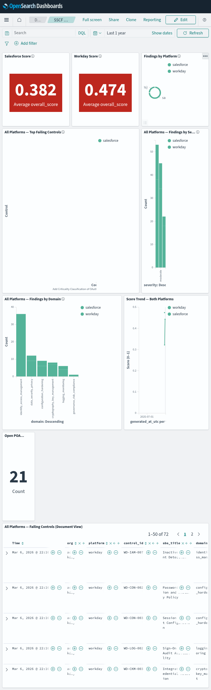

# OpenSearch Dashboards Guide

> **Optional — not required to run assessments.**
> The core pipeline writes JSON, Markdown, and DOCX artifacts that stand on their own.
> Dashboards are for teams who want trending, cross-org comparison, and continuous monitoring.

> **Network security:** `localhost` URLs below use `http://` because the Docker stack runs with
> `DISABLE_SECURITY_PLUGIN=true` on a private bridge network — dev only. All external API calls
> (Salesforce, Workday, OpenAI) use HTTPS exclusively. Do not expose port 9200 or 5601 externally.

---

## The Three Dashboards

Three pre-built dashboards are imported automatically when the Docker stack starts.
Access them at **http://localhost:5601** → Dashboards (left sidebar).

| Dashboard | ID | Purpose |
|---|---|---|
| **SSCF Security Posture Overview** | `sscf-main-dashboard` | Combined view — both platforms side-by-side, score comparison, domain risk, trends |
| **Salesforce Security Posture** | `sfdc-dashboard` | Salesforce-only — all 14 panels filtered to `platform:salesforce` |
| **Workday Security Posture** | `workday-dashboard` | Workday-only — all 14 panels filtered to `platform:workday` |

> **Platform isolation is enforced at the visualization level.** Every chart on the Salesforce dashboard
> carries a `platform : salesforce` KQL filter. The Workday dashboard carries `platform : workday`.
> Neither dashboard will show data from the other platform regardless of what is indexed.

---

## Screenshots

### SSCF Security Posture Overview (Combined)


### Salesforce Security Posture


### Workday Security Posture


---

## Starting the Stack

```bash
# Start OpenSearch + Dashboards + auto-import all saved objects
docker compose up -d

# Wait ~60 seconds for dashboards service to become healthy
curl -s http://localhost:5601/api/status | python3 -m json.tool | grep state

# Open dashboards
open http://localhost:5601
```

The `dashboard-init` service imports all 40 saved objects (2 index patterns, 35 visualizations,
3 saved searches, 3 dashboards) automatically on first start.

---

## Getting Data Into the Dashboards

After every assessment run, export the results:

```bash
# Auto-discover artifacts by org + date
python scripts/export_to_opensearch.py --auto --org <org-alias> --date <YYYY-MM-DD>

# Or use the interactive runner (handles export automatically if you opt in)
python scripts/run_assessment.py
```

The exporter writes to two indices:

| Index | One doc per | Key fields |
|---|---|---|
| `sscf-runs-YYYY-MM` | Assessment run | org, platform, overall_score, nist_verdict, domain scores, counts |
| `sscf-findings-YYYY-MM` | Finding | control_id, sbs_title, domain, severity, status, owner, due_date, poam_status, remediation |

### Quick examples

```bash
# Salesforce live run → export
agent-loop run --env dev --org cyber-coach-dev --approve-critical
python scripts/export_to_opensearch.py --auto --org cyber-coach-dev --date $(date +%Y-%m-%d)
open "http://localhost:5601/app/dashboards#/view/sfdc-dashboard"

# Workday dry-run → export
python3 scripts/workday_dry_run_demo.py --org acme-workday --env dev
python scripts/export_to_opensearch.py --auto --org acme-workday --date $(date +%Y-%m-%d)
open "http://localhost:5601/app/dashboards#/view/workday-dashboard"
```

---

## Salesforce Security Posture Dashboard

**URL:** `http://localhost:5601/app/dashboards#/view/sfdc-dashboard`
**Filter:** All panels scoped to `platform : salesforce`
**Best for:** SBS quarterly reviews, SFDC admin team briefings, pre-audit evidence reviews

### Panel layout (14 panels)

#### Row 1 — At-a-Glance Metrics

| Panel | Type | What it shows |
|---|---|---|
| **Salesforce Score** | Metric tile | Average overall score across all Salesforce runs — RED (< 50%), AMBER (50–75%), GREEN (> 75%) |
| **Controls Passing** | Count tile | Number of controls with `status : pass` |
| **Controls Failing** | Count tile | Number of controls with `status : fail` |
| **Critical Failures** | Count tile | Controls with `status : fail AND severity : critical` |
| **Open POA&M Items** | Count tile | Controls with `poam_status : Open` |

#### Row 2 — Top Findings

| Panel | Type | What it shows |
|---|---|---|
| **Top Failing Controls** | Horizontal bar | Top 10 fail/partial controls by full control title, colored by severity (critical/high/moderate/low). Click any bar to filter the whole dashboard. |
| **Control Status** | Donut chart | Pass / Fail / Partial / Not Applicable distribution — gives instant sense of overall posture |

#### Row 3 — Risk Breakdown

| Panel | Type | What it shows |
|---|---|---|
| **Risk by Domain** | Stacked vertical bar | Fail/partial findings per SSCF domain (IAM, CON, DSP, LOG, IPY, SEF), stacked by status. Identifies which security domains have the most exposure. |
| **Findings by Severity** | Stacked vertical bar | All findings grouped by severity, stacked by status (pass/fail/partial/na). Shows the severity profile across the full control set. |

#### Row 4 — Accountability & Trends

| Panel | Type | What it shows |
|---|---|---|
| **Open Items by Owner** | Horizontal bar | Which owner/team carries the most open fail/partial findings. Use this to assign remediation sprint owners. |
| **Score Over Time** | Line chart | Average Salesforce overall score across all assessment runs indexed. Shows remediation progress or regression over time. |

#### Row 5 — Detail Tables

| Panel | Type | What it shows |
|---|---|---|
| **Critical & High Failures** | Aggregation table | All critical/high fail/partial findings: Severity · Control ID · Description · Domain. Use for priority-setting. |
| **POA&M Open Items** | Aggregation table | All Open/In Progress items: Control · Severity · POA&M Status. Use for governance tracking. |

#### Row 6 — Document View

| Panel | Type | What it shows |
|---|---|---|
| **Salesforce — Failing Controls** | Saved search | Every fail/partial row as a document: control_id · title · domain · severity · status · poam_status · owner · due_date · remediation. Sortable by any column. |

---

## Workday Security Posture Dashboard

**URL:** `http://localhost:5601/app/dashboards#/view/workday-dashboard`
**Filter:** All panels scoped to `platform : workday`
**Best for:** WSCC compliance reviews, Workday HCM/Finance security briefings, integration audit prep

The Workday dashboard has the **identical 14-panel layout** as the Salesforce dashboard,
with all queries filtered to `platform : workday`. Every chart shows only Workday WSCC findings.

Panel descriptions are the same as Salesforce above — substitute WSCC controls and Workday domain coverage.

---

## SSCF Security Posture Overview Dashboard

**URL:** `http://localhost:5601/app/dashboards#/view/sscf-main-dashboard`
**Filter:** No platform filter — shows all platforms
**Best for:** Monthly leadership reviews, cross-platform risk comparisons, executive briefings

### Panel layout (9 panels)

#### Row 1 — Score Comparison

| Panel | Type | What it shows |
|---|---|---|
| **Salesforce Score** | Metric tile | Average overall score for Salesforce runs (RED/AMBER/GREEN) |
| **Workday Score** | Metric tile | Average overall score for Workday runs (RED/AMBER/GREEN) |
| **Findings by Platform** | Donut chart | Total finding count split by platform — shows relative assessment coverage |

#### Row 2 — Cross-Platform Failures

| Panel | Type | What it shows |
|---|---|---|
| **All Platforms — Top Failing Controls** | Horizontal bar | Top 10 fail/partial controls across all platforms, bars colored by platform. Reveals controls failing on both Salesforce AND Workday. |
| **All Platforms — Findings by Severity** | Vertical bar | Severity distribution, bars split by platform. Shows whether Salesforce or Workday carries more high-severity risk. |

#### Row 3 — Domain & Trends

| Panel | Type | What it shows |
|---|---|---|
| **All Platforms — Findings by Domain** | Vertical bar | Fail/partial findings per SSCF domain, stacked by platform. Highlights which security domains are weakest across all connected SaaS. |
| **Score Trend — Both Platforms** | Line chart | Score over time with a line per platform. Track remediation velocity for each platform independently. |

#### Row 4 — Governance Metrics

| Panel | Type | What it shows |
|---|---|---|
| **Open POA&M (All Platforms)** | Count tile | Total open POA&M items across all platforms |

#### Row 5 — Full Document View

| Panel | Type | What it shows |
|---|---|---|
| **All Platforms — Failing Controls** | Saved search | Every fail/partial row across all orgs and platforms: org · platform · control_id · title · domain · severity · status · poam_status · owner · due_date · remediation |

---

## Navigating the Dashboards

### Score color thresholds

| Color | Score range | Meaning |
|---|---|---|
| 🔴 RED | 0–50% | High risk — multiple critical/high failures; immediate action required |
| 🟡 AMBER | 50–75% | Moderate risk — partial controls, remediation plan needed |
| 🟢 GREEN | 75–100% | Low risk — most controls passing; minor gaps only |

### Interactivity

- **Click any bar or donut slice** — filters the entire dashboard to that value (e.g. click "critical" to see only critical findings across all panels)
- **Search bar (top)** — add any KQL filter: `org : cyber-coach-dev`, `domain : identity_access_management`, `severity : critical`
- **Time picker (top-right)** — default is last 1 year; narrow to a specific assessment date to see a point-in-time view
- **Sort document table** — click any column header to sort by severity, due date, owner, etc.

### Finding "No results"

If a panel shows "No results", check:
1. **Time picker** — confirm it covers the date the assessment was exported
2. **Export ran** — `python scripts/export_to_opensearch.py --auto --org <alias> --date <date>`
3. **Index exists** — `curl http://localhost:9200/_cat/indices?v | grep sscf`

---

## Direct Links

| Dashboard | URL |
|---|---|
| Combined overview | http://localhost:5601/app/dashboards#/view/sscf-main-dashboard |
| Salesforce | http://localhost:5601/app/dashboards#/view/sfdc-dashboard |
| Workday | http://localhost:5601/app/dashboards#/view/workday-dashboard |
| All dashboards | http://localhost:5601/app/dashboards |
| Discover (raw docs) | http://localhost:5601/app/data-explorer/discover |

---

## Saved Objects Reference

All 40 saved objects live in `config/opensearch/dashboards.ndjson` and are generated by
`scripts/gen_dashboards_ndjson.py`. They are imported automatically by the `dashboard-init`
service on every stack start.

| Type | Count | Notes |
|---|---|---|
| Index pattern | 2 | `sscf-runs-*`, `sscf-findings-*` |
| Visualization | 35 | Score tiles, count tiles, donut pies, horizontal/vertical bars, line trends, agg tables |
| Saved search | 3 | Platform-filtered document views |
| Dashboard | 3 | Overview, Salesforce, Workday |

### Visualization naming convention

| Prefix | Scope |
|---|---|
| `viz-sfdc-*` | Salesforce-only (KQL: `platform : salesforce`) |
| `viz-wd-*` | Workday-only (KQL: `platform : workday`) |
| `viz-combined-*` | All platforms — used by the overview dashboard only |

### Regenerating the NDJSON

If you add a new platform or want to change the layout:

```bash
python3 scripts/gen_dashboards_ndjson.py   # rewrites config/opensearch/dashboards.ndjson

# Re-import into running stack
curl -X POST "http://localhost:5601/api/saved_objects/_import?overwrite=true" \
  -H "osd-xsrf: true" \
  --form file=@config/opensearch/dashboards.ndjson
```

### Manual re-import (e.g. after resetting OpenSearch)

```bash
curl -X POST "http://localhost:5601/api/saved_objects/_import?overwrite=true" \
  -H "osd-xsrf: true" \
  --form file=@config/opensearch/dashboards.ndjson
```

---

## Time Range

Dashboards default to **last 1 year** so all historical assessment data is visible by default.

Use the time picker to zoom into a specific date range — useful for showing improvement
between two assessment cycles, e.g. `2026-02-01` to `2026-03-09`.

---

## Troubleshooting

| Issue | Fix |
|---|---|
| Dashboard shows "No results" | Check time picker — confirm it covers the assessment date; re-run export |
| Score tiles show "No data" | Run `export_to_opensearch.py` after assessment; verify `sscf-runs-*` index exists |
| `dashboard-init` service failed | Re-run: `docker compose restart dashboard-init` |
| Dashboards not loading | Wait 60 s after `docker compose up -d` for full startup |
| `opensearch-py not installed` | `pip install opensearch-py` or `pip install -e ".[monitoring]"` |
| Port 9200/5601 conflict | Stop conflicting service or change ports in `docker-compose.yml` |
| Apple Silicon (M-series) OOM | Reduce heap: `OPENSEARCH_JAVA_OPTS=-Xms256m -Xmx256m` in compose |
| Wrong platform on findings | Verify `backlog.json` has `"platform"` field; re-export with `--org` flag |
| Salesforce data on Workday dashboard | Re-import: `curl -X POST "http://localhost:5601/api/saved_objects/_import?overwrite=true" -H "osd-xsrf: true" --form file=@config/opensearch/dashboards.ndjson` |
